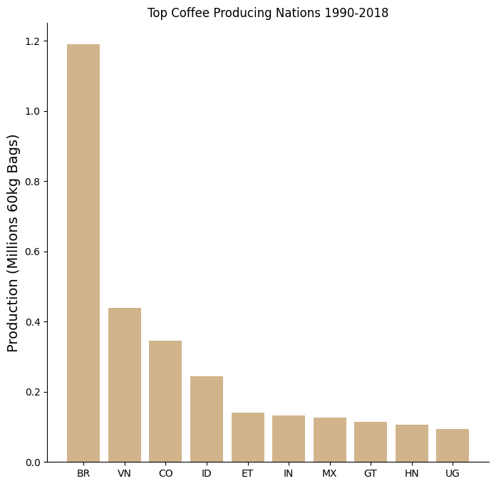

# Caffeine Summit

Python | Jupyter notebook | Pandas | Matplotlib 

# Description and Objective

In Anticipation of the upcoming Caffeine Summit, The Director-General of the World Health Organization (WHO) has identified a critical need to investigate global coffee production and consumption patterns due to increasing concerns about the economic and health impacts on coffee-producing regions.

To address this issue, the Director-General has tasked the data analysis team to analyze health implications of coffee production. The analysis should cover:

- Total Production Overview: Understanding global coffee production trends.
- Top 5 Producers Over Time: Identifying and tracking the top 5 coffee-producing countries over a specified period.
- Brazil's Contribution: Analyzing Brazil's role in global coffee production and its trends over time.
- Global coffee production percentage.
- Coffee Consumption Vs. Prices: Investigating the relationship between coffee consumption rates and coffee prices.
- Combination of result in a single report.

# Data

- Source : https://mavenanalytics.io
- Relevant files include:
`total-production.csv`
`imports.csv`
- The files containing `coffeine_part_1.ipynb` and `coffeine_part_2.ipynb` have the detailed analysis with the code for the implementation.

# Data Cleaning and Manipulation

- Check for missing values, and calculate the minimum, maximum, and average for each numeric field.
- Filter the dataframe down to relevant columns.
- Cast any date columns from the dataframe to the datetime type/format.
- Data is available in the coffee folder.

# Analytical Tasks

### - Total Production Overview: Understanding global coffee production trends.
- A bar chart depicting the countries and their production of 60kg coffee bags in thousands.
- Brazil BR, Vietnam VN, columbia CO, Indonesia IN, Ethopia ET, India IN, Mexico MX, Guatemala GT, Honduras HN, Uganda UG.

### - The Top 5 Producers Over Time: Identifying and tracking the top 5 coffee-producing countries over a specified period.
- Line chart with the top 5 nations over time.
- Brazil BR, Vietnam VN, columbia CO, Indonesia IN, Ethopia ET from 1990 - 2018.

### - Brazil's Contribution: Analyzing Brazil's role in global coffee production and its trends over time.
- A stackplot displaying the role of brazil and rest of the world for global coffee production.
- Total global production as well as Brazil's contribution to global production over time.

### - Global coffee production percentage.
- Brazil's share of global production in 1990, and one for Brazil's share in 2018.

### - Composition of all the top 5 producers
- Countries and their production percentage.

### - Coffee Consumption Vs. Prices: Investigating the relationship between coffee consumption rates and coffee prices.

- Comparing coffee prices with coffee consumption.
- A dual axis bar chart of price vs consumption totals.

# Charts
- Bar chart
- line chart
- Stackplot
- Doughnut charts
- Pie chart
- Dual axis bar chart

# Final Report

Details:

* Meshgrid Layout to combine our findings in a single report. 
* The two donut charts, stackplot comparing Brazil to the rest of the world, a bar chart showing the total production of top 5 countries and a bar for other countries.
* Setting rcParams to turn top and right borders off.

 Given:

- Total global coffee production in 1990 = 133117.37 (in thousand 60kg bags)
- Total global coffee production in 2018 = 216722.74 (in thousand 60kg bags)

Market Expansion:

- Percentage Expansion = (( Value in 2018 − Value in 1990 ) / Value in 1990 ) * 100
- Percentage Expansion = ( 83505.37 / 133117.37 )  x 100
- Percentage Expansion = 62.74 %

